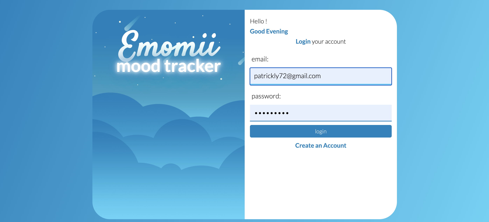
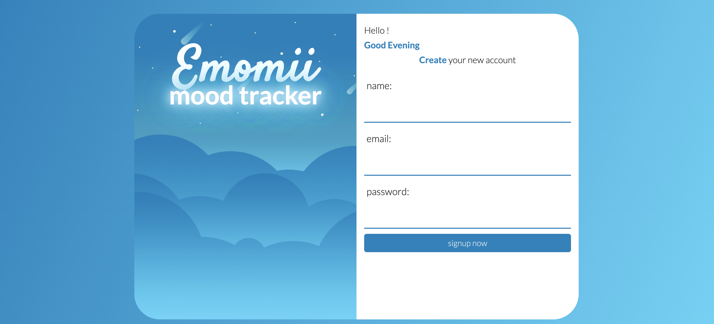
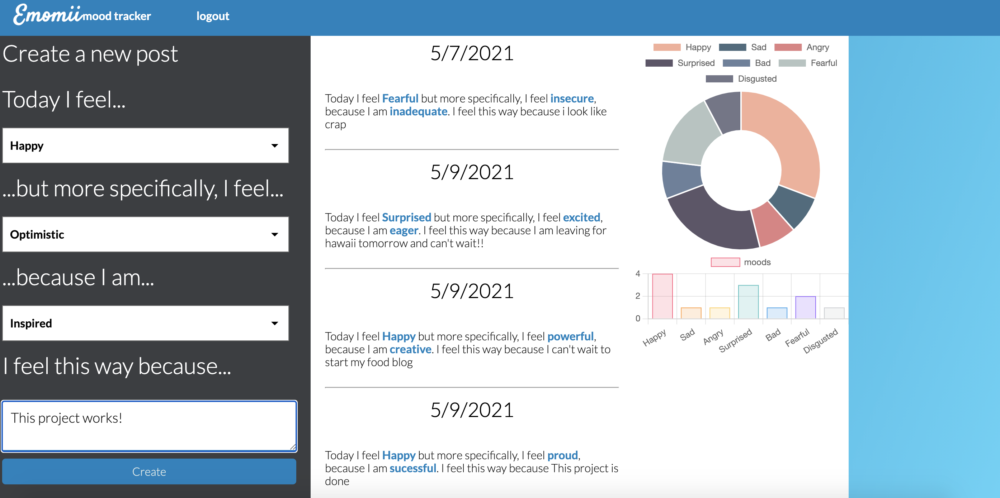
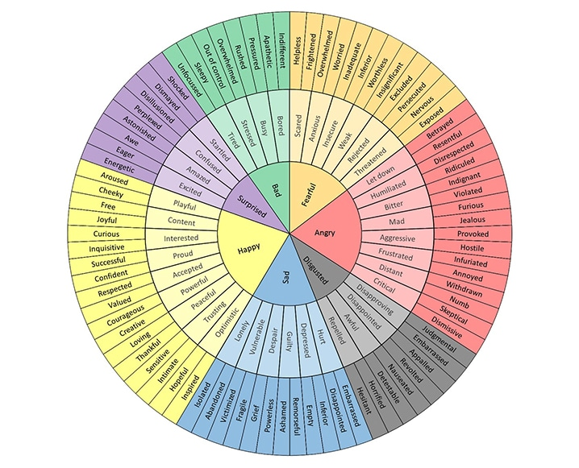

# Emomii - Mood Tracker
[](https://www.gnu.org/licenses/gpl-3.0)
## Table of contents
1. [Description](#description)
2. [Usage](#usage)
3. [Technology](#technology)
4. [Contributing](#contributing)
5. [License](#license)
6. [Screenshot](#screenshot)
7. [Questions](#questions)
    
<a name="description"></a>
## Description
A Daily mood tracker and journal to help users identify patterns that can point them toward lifestyle or behavioral improvements and help them become more emotionally intelligent

### How we made this
### Landing Page:
<br>
For the landing page, the user is greeted with the proper greeting based on the time of day. 
```
var curHr = today.getHours();

if (curHr < 12) {
    function goodmorning() {
        const grettingEl = document.getElementById("greeting");
        if (grettingEl) {
          grettingEl.innerHTML = "Good Morning";
        }
      }

      goodmorning()
} else if (curHr < 18) {
    function goodafternoon() {
        document.getElementById("greeting").innerHTML = "Good Afternoon";
      }
      goodafternoon()
} else {
    function goodevening() {
        document.getElementById("greeting").innerHTML = "Good Evening";
      }
      goodevening()
};
```

then we have a simple form requesting that the user enter in their email and password. If the user does not have an account already set up, they can click on create an account which has an eventlistener on it and dynamically changes the login form to a sign up form


### Dashboard:
Once the user has logged in they are taken to their dashboard where they can start adding entries to their moodtracker. 

for reference we used this feelings wheel chart to help us interpret feelings and moods into for which we called parentfeelings, childfeelings, and grandchildfeelings. 

The way that whis wheel works is based on an understanding that most feelings come from 7 "parent feelings" and from the parent feelings, we have a subclass of feelings for which we called child feelings, and the child feelings had another subclass for which we called grandchild feelings. 

To implement this into our application we created a form with conditionals so that when you select an option from the first dropdown menu, the second dropdown menu will populate with the child feelings, and when you select an option from the second dropdown menu, the third dropdown menu will populate with the grandchild feelings. 
```
function populatechildren(parentfeelings, childfeelings) {
  childfeelings.innerHTML = "";
  if (parentfeelings.value == "Happy") {
    var optionArray = [
      "|",
      "playful|Playful",
      "content|Content",
      "interested|Interested",
      "proud|Proud",
      "accepted|Accepted",
      "powerful|Powerful",
      "peaceful|Peaceful",
      "trusting|Trusting",
      "optimistic|Optimistic",
    ];
  } else if (parentfeelings.value == "Sad") {
    var optionArray = [
      "|",
      "lonely|Lonely",
      "vunerable|Vunerable",
      "despair|Despair",
      "guilty|Guilty",
      "depressed|Depressed",
      "hurt|Hurt",
    ];
  } else if (parentfeelings.value == "Angry") {
    var optionArray = [
      "|",
      "letdown|Letdown",
      "humiliated|Humiliated",
      "bitter|Bitter",
      "mad|Mad",
      "agressive|Agressive",
      "frustrated|Frustrated",
      "distant|Distant",
      "critical|Critical",
    ];
  } else if (parentfeelings.value == "Surprised") {
    var optionArray = [
      "|",
      "startled|Startled",
      "confused|Confused",
      "amazed|Amazed",
      "excited|Excited",
    ];
  } else if (parentfeelings.value == "Bad") {
    var optionArray = [
      "|",
      "bored|Bored",
      "busy|Busy",
      "stressed|Stressed",
      "tired|Tired",
    ];
  } else if (parentfeelings.value == "Fearful") {
    var optionArray = [
      "|",
      "scared|Scared",
      "anxious|Anxious",
      "insecure|Insecure",
      "weak|Weak",
      "rejected|Rejected",
      "threatened|Threatened",
    ];
  } else if (parentfeelings.value == "Disgusted") {
    var optionArray = [
      "|",
      "disapproving|Disapproving",
      "disenchanted|Disenchanted",
      "awful|Awful",
      "repelled|Repelled",
    ];
  }
  for (var option in optionArray) {
    var pair = optionArray[option].split("|");
    var newOption = document.createElement("option");
    newOption.value = pair[0];
    newOption.innerHTML = pair[1];
    childfeelings.options.add(newOption);
  }
}

```
Once the user has filled out the form, a post will be created and will display on the page. For the charts we used ChartJS to help us generate the charts for the page. To render out the charts first we did a fetch call to return the JSON of all the users entries
```
const getPostdata = async () => {
  

  fetch(`/api/posts`)
    .then(function (response) {
      return response.json();
    })
    .then(function (data) {
      var emotions = {};

      for (i = 0; i < data.length; i++) {
        var emotion = data[i].parentMood;
console.log ("this is the emotions:"+emotion)
        if (emotion in emotions) {
          emotions[emotion]++;
        } else {
          emotions[emotion] = 1;
        }
      }
     
      console.log(emotions);
      renderChart(emotions);
      renderSecondChart(emotions);
    });
  
};
```

then we created a loop to iterate through the JSON and track count how many times each parent feeling has been entered and then we just this data to generate the chart that you see on the page. 


<a name="usage"></a>
## Usage

1. When you get to the main page, you can either login if you already have an account or create a new account by clicking on Create an Account. 

2. Once you're logged in, you can start logging your moods and even include a brief entry about why you think you are feeling a certain way. Once you hit create, your post will automatically populate and the charts and graphs will update and start tracking your moods and emotions. 


<a name="technology"></a>
## Technology
1. HTML
2. CSS
3. Javascript
4. Node.js
5. Mysql
6. Express.js
7. Sequelize
8. Handlebars
9. Bcrypt
10. Heroku
11. JawsDB
12. Chart.js


<a name="contributing"></a>
## Contributing
This project is currently open source so feel free to for the repository and make it your own
    
<a name="license"></a>
## License
[](https://www.gnu.org/licenses/gpl-3.0)
<a name="screenshot"></a>
## Screenshot

    
<a name="questions"></a>
## Questions
Feel free to check out our [GitHub](https://github.com/SerenaChandler/Project2) repository. Also feel free to send us an email at <patrickly72@gmail.com>, <serenachandler2019@gmail.com>, or <erickmeline@gmail.com> if you have any questions

